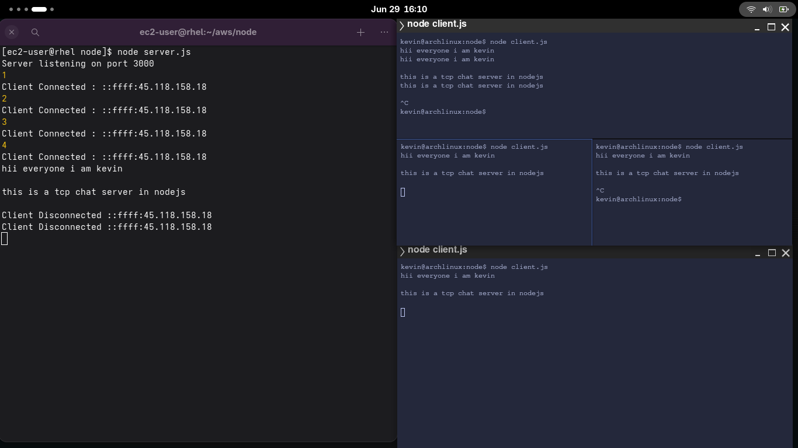

# 🐚 ShellSpeak

## 📸 Screenshot

ShellSpeak is a simple terminal-based group chat app built with Node.js using raw TCP sockets.  
It lets multiple clients connect to a server and exchange messages in real-time right from the command line.

---

## 🚀 Features

✅ Group chat for multiple clients  
✅ Real-time messaging over TCP  
✅ Simple CLI interface  
✅ Node.js net module only (no extra dependencies)  
✅ Clean, readable console output

---

## 📦 Requirements

- Node.js (v14 or newer recommended)

---